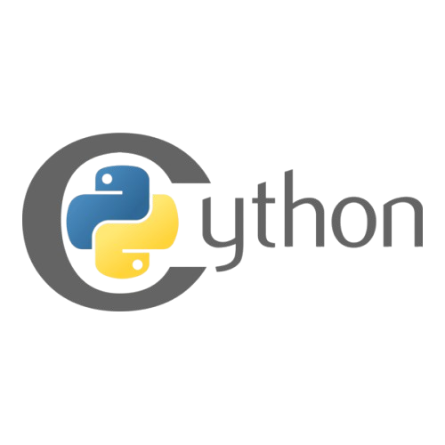

### **CPython**

---



---

### Why This Build System Helps Your Project?

- **This setup makes your workflow faster, cleaner, and more professional. Instead of manually rebuilding every time, everything is automated and reusable.**

---

### Easier Rebuilds

- **You don’t need to manually open setup.py and rebuild the** `.pyx` **into** `.pyd` **or rename it into** `.dll` **.**
- **The ready-made build script does everything with one command.**
- **This saves time and effort, especially in large projects.**

---

### Fewer **Errors**

- **All those issues with** **`ModuleNotFound`**, **version mismatches, or wrong file names are avoided.**
- **The final version keeps everything consistent and properly linked.**

---

### Code Reusability

- **If you have another project or a new version of the same project, you can reuse the compiled** **`.pyd`** **and** **`.dll`** **files without rewriting or recompiling your source code**

---

### Easy Distribution

- **When sharing your project with others, you only need to provide the ready files** **(`.pyd`, `.dll`, `.py`).**
- **No need for the other person to install `Cython` or `Visual Studio` they can run it directly.**

---

### Faster Execution

- **Since the program skips build steps, it runs immediately. This is important for continuous testing or running large projects without rebuild overhead.**

---
### in Short
- T**his system makes your project more professional, portable, and future-proof, while saving you from common `Python`/`Cython` headaches.**

---

### How Installation

```
$ MicroSoft C++ BuildTools.exe
```

### Visual Studio Installer (Build Tools 2022)
### Trun On Option

- **Desktop development with C++**

---
### **Your Need Packages**
- `✅` **MSVC v143 - VS 2022 C++ `x64`/`x86` build tools**
- `✅` `Windows 10` **SDK (10.0.19041.0)** `or` `Windows 11` **SDK (10.0.22000.0)**
- `✅` **C++ CMake tools for Windows**

---

### **Your Not Need Packages**

- `❌` **.NET desktop development**
- `❌` **Game development with C++**
- `❌` **Linux/WSL development**
- `❌` **Mobile development**
- `❌` **Universal Windows Platform (UWP)**
- `❌` **Any packages for `"C++ Clang"` or `"ARM compilers"` unless they run on ARM platforms**

---

### Size storge 

- **The installation size if you only take what you need will be approximately `2-3GB` instead of `10+GB.`**

---

### **Requirements Installation** 

```
pip install -r requirements.txt
```

### **Run**

```
python CPython.py
```

---

### **OR**

- **Name File ->** `BuildTools.py`

```python
import os
import sys
import glob
import shutil
import time
os.system("python setup.py build_ext --inplace")
python_version = f"cp{sys.version_info.major}{sys.version_info.minor}"
pattern = f"mylib.{python_version}-win_amd64.pyd"
files = glob.glob(pattern)
if not files:
    raise FileNotFoundError(f"File {pattern} not found")
pyd_file = files[0]
print(f"Found PYD: {pyd_file}")
shutil.copyfile(pyd_file, "mylib.dll")
dll_path = os.path.abspath("mylib.dll")
print(f"Created DLL at: {dll_path}")
time.sleep(1)
os.system(f'python dll.py')
```

---

| Windows | Linux | MacBook |
|---------|-------|---------|
|   ✅   |   ❌  |   ❌   |

---
